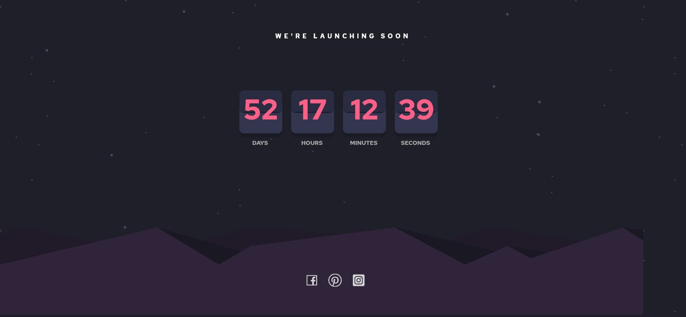

## Table of contents

- [Overview](#overview)
  - [The challenge](#the-challenge)
  - [Screenshot](#screenshot)
  - [Links](#links)
- [My process](#my-process)
  - [Built with](#built-with)
  - [What I learned](#what-i-learned)
  - [Continued development](#continued-development)
- [Author](#author)

## Overview

### The challenge

Users should be able to:

- See hover states for all interactive elements on the page
- See a live countdown timer that ticks down every second

### Screenshot



### Links

- Live Site URL: [Add live site URL here](https://launching-app.netlify.app/)

## My process

### Built with

- CSS custom properties
- Flexbox
- CSS Grid
- Mobile-first workflow
- [React](https://reactjs.org/) - JS library
- [CSS modules](https://create-react-app.dev/docs/adding-a-css-modules-stylesheet/) - For styles
- [Little bit of SASS](https://sass-lang.com/)
- A lot of LOVE :)

### What I learned

I had a lot of fun with this project, especially with creating the card elements. I had to use the pseudo effect after:: in order to create a single div with 2 colors.
Although this is possible with the linear gradient function as well, I had to do it this way in order to achieve the shadow effect in the bottom part of the upper div.

It was also really nice to create the countdown function. The implementation of it is quite simple you can have a look at the CountdownCard component.

To see how you can add code snippets, see below:

```


### Continued development

I will soon implement a card flip animation for when number changes on one of the cards.
I also have to fix the bug that the countdown does not stop when reaches to 0.


## Author

- Website - [Nitsan Cohen Portfolio](https://nitsan-portfolio.netlify.app/)
- Linkedin - [@Nitsan Cohen](https://www.linkedin.com/in/nitsan-cohen-64b73920b/)


```
